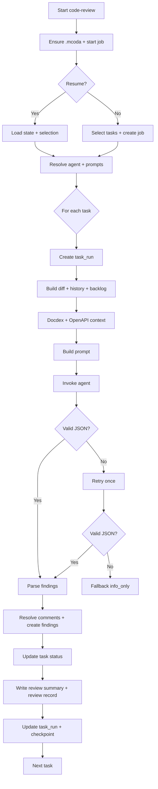

# Code-Review Workflow

This document describes the current `code-review` command flow as implemented in `CodeReviewService` (`packages/core/src/services/review/CodeReviewService.ts`).

## Overview
`code-review` selects tasks in `ready_to_review`, builds a rich review prompt (diff + docdex + history + open comments), invokes a review agent, parses JSON findings, applies comment resolution, updates task status, and records review artifacts.

## Inputs and defaults
- Task scope: `projectKey`, `epicKey`, `storyKey`, `taskKeys`, `statusFilter`, `limit`.
- Base ref: `baseRef` (defaults to workspace config branch, then `mcoda-dev`).
- Execution flags: `agentName`, `agentStream`, `dryRun`, `rateAgents`, `resumeJobId`.
- Status default: `ready_to_review`.

## High-level phases
1. Init + selection (including resume handling)
2. Per-task review
3. Finalize and report

## Detailed workflow

### 1) Init + selection
1. Ensure `.mcoda/` exists and is in `.gitignore`.
2. Start a `command_run` for `code-review`.
3. If `resumeJobId` is provided:
   - Load saved state and selected task ids.
   - Restore job progress counters.
4. Otherwise, select tasks using the API backlog (preferred) with a fallback to `TaskSelectionService`.
5. Create a `review` job and persist the selection state.
6. Resolve the review agent and load:
   - Agent prompts.
   - Runbook/checklists in `.mcoda/checklists`.
   - Project guidance (`docs/project-guidance.md` or `.mcoda/docs/project-guidance.md`).

### 2) Per-task review (for each selected task)

#### 2.1 Task run setup
1. Create a `task_run` row (status: `running`).
2. Determine status before review (`statusBefore`).

#### 2.2 Context assembly
1. Build git diff against `baseRef` (optionally scoped to `metadata.files`).
   - If the diff is empty, block the task with `review_empty_diff` and skip agent invocation.
2. Build history summary from prior comments/reviews.
3. Load unresolved comment backlog from `code-review` and `qa-tasks`.
4. Query docdex for context based on:
   - Task title
   - Changed paths
   - Acceptance criteria
5. Build an OpenAPI snippet (if available) for the touched paths.
6. Persist diff/context artifacts and checkpoints.

#### 2.3 Prompt assembly
1. Merge system prompts (job prompt + character prompt + command prompt + runbooks).
2. Build a review prompt that includes:
   - Task metadata and status
   - History + comment backlog
   - Docdex excerpts
   - OpenAPI slice (if available)
   - Diff
3. Enforce strict JSON response format with schema:
   - `decision`, `summary`, `findings[]`, `testRecommendations[]`, `resolvedSlugs[]`, `unresolvedSlugs[]`

#### 2.4 Agent invocation and JSON handling
1. Invoke the agent (streaming or sync).
2. Record token usage for the main attempt.
3. If JSON parsing fails, retry once with stricter instructions.
4. If parsing still fails:
   - Block the task with `review_invalid_output`.
   - Record a task comment requesting a re-run with a stricter model.

#### 2.5 Apply results
1. Resolve comment slugs:
   - Mark `resolvedSlugs` as resolved.
   - Reopen `unresolvedSlugs` as needed.
   - Create new comments for review findings with generated slugs.
   - If unresolved comment slugs remain, force `changes_requested` and summarize open slugs.
2. Optionally create follow‑up tasks based on findings.
3. Update task state (unless `dryRun`):
   - `approve` or `info_only` → `ready_to_qa`
   - `changes_requested` → `in_progress`
   - `block` → `blocked` with `review_blocked`
4. Create a review summary comment and a task review record.
5. Update the `task_run` to `succeeded`.
6. Persist checkpoint (`review_applied`).

#### 2.6 Errors
1. On any exception:
   - Log a `review_error`.
   - Write a summary comment with error details.
   - Mark task run as `failed`.
   - Persist checkpoint.

#### 2.7 Rating
If `rateAgents` is enabled, record a rating for this review run.

### 3) Finalize and report
1. Update job status and processed item counts.
2. Finish the command run (`succeeded` or `failed` with summary).

## Gateway-trio integration notes
- `gateway-trio` treats `approve` and `info_only` as success and advances to QA.
- `changes_requested` causes a work retry in the next cycle; feedback tasks are prioritized.
- `block` or `review_invalid_output` stop the task with `review_blocked` until manually reopened or resumed.

## Mermaid diagram

