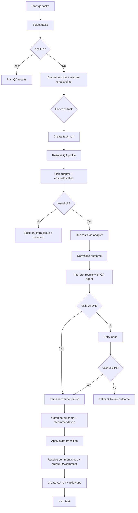

# QA Workflow

This document describes the current `qa-tasks` command flow as implemented in `QaTasksService` (`packages/core/src/services/execution/QaTasksService.ts`).

## Overview
`qa-tasks` runs automated QA checks using a selected QA profile (CLI/browser/etc.), then asks a QA agent to interpret the results and produce structured JSON. It updates task state, creates QA comments and follow‑up tasks, and records QA telemetry.

## Inputs and defaults
- Task scope: `projectKey`, `epicKey`, `storyKey`, `taskKeys`, `statusFilter`.
  - Default status filter: `ready_to_qa`.
- Mode: `mode=auto` (default) or `mode=manual`.
- QA profile: `profileName`, `level`, `testCommand` override.
- Output options: `agentName`, `agentStream`, `createFollowupTasks`, `dryRun`, `rateAgents`.
- Resume: `resumeJobId` (checkpoint-based resume).

## High-level phases
1. Init + selection (including resume handling)
2. Per-task QA run (auto or manual)
3. Finalize and report

## Detailed workflow

### 1) Init + selection
1. Select tasks with `TaskSelectionService` (or use resume payload).
2. If `dryRun`:
   - Resolve QA profile per task when possible.
   - Return planned results without running tests.
3. Ensure `.mcoda/` exists and is in `.gitignore`.
4. If resuming:
   - Load checkpoints to skip completed tasks.

### 2) Per-task QA run (auto mode)

#### 2.1 Task run setup
1. Create a `task_run` row (status: `running`).
2. Resolve QA profile using `QaProfileService`:
   - By `profileName`/`level` override if provided.
   - Otherwise by task tags/type, then default profile.

#### 2.2 Adapter selection and install check
1. Pick adapter by profile runner:
   - `cli`, `chromium` (headless Chromium/Playwright), or `maestro`.
2. Call `ensureInstalled` on the adapter.
3. If install fails:
   - Mark task `blocked` with `qa_infra_issue`.
   - Create a `qa_issue` comment.
   - Record a QA run with `infra_issue` outcome.

#### 2.3 Execute QA tests
1. Resolve test command (profile + optional override).
2. Build QA context (workspace root, job id, task key, env).
3. Run tests via adapter (`invoke`).
4. Normalize outcome:
   - CLI adapter may treat “no tests found / skipping tests” as `infra_issue`.
   - If `tests/all.js` is used, it must emit `MCODA_RUN_ALL_TESTS_COMPLETE`; missing markers are treated as `infra_issue`.

#### 2.4 Interpret results with QA agent
1. Load project guidance and docdex context.
2. Build a QA interpretation prompt with:
   - Task metadata + acceptance criteria
   - Comment backlog (unresolved slugs)
   - Test stdout/stderr + artifacts
3. Invoke QA agent and parse strict JSON:
   - If parsing fails, retry once with stricter JSON instruction.
   - If still invalid, record `unclear` and capture the raw output for manual QA follow-up.

#### 2.5 Apply results
1. Combine raw test outcome + agent recommendation:
   - `infra_issue` dominates.
   - `fix_required` dominates if either side requests it.
   - `unclear` is preserved if the agent requests it.
2. Apply state transition:
   - `pass` → `completed`
   - `fix_required` → `in_progress`
   - `infra_issue` → `blocked` with `qa_infra_issue`
   - `unclear` → `blocked` with `qa_unclear`
3. Resolve QA comment slugs:
   - Mark `resolvedSlugs`, reopen `unresolvedSlugs`.
   - Create new QA comment(s) for failures.
4. Create a QA run record with artifacts and token usage.
5. Create follow‑up tasks if `fix_required` (or invalid JSON) and follow‑ups are enabled.
   - Follow‑ups are deduplicated via a stable `qa_followup_slug` in task metadata.

#### 2.6 Rating
If `rateAgents` is enabled, record an agent rating for the QA interpretation run.

### 2) Per-task QA run (manual mode)
1. Create a `task_run` row.
2. Use `result`/`notes` from the request instead of executing tests.
3. Apply the same state transitions and follow‑up task logic.
4. Create QA comments and a QA run record.

### 3) Finalize and report
1. Update job progress counters and checkpoints.
2. Finish the command run.

## Gateway-trio integration notes
- `gateway-trio` treats `pass` as completion and loops back on `fix_required` or `unclear`.
- `qa_infra_issue` blocks the task; expired QA blocks are reopened on resume when allowed.
- Feedback tasks (QA fix requests) are prioritized in subsequent cycles.

## Mermaid diagram

