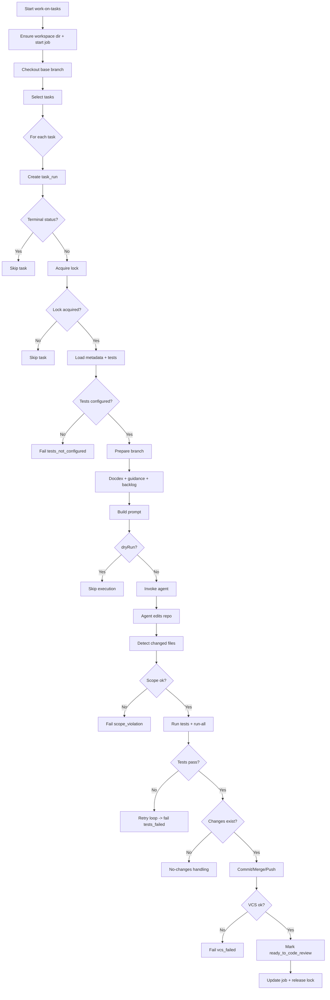

# Work-on-Tasks Workflow

This document describes the current `work-on-tasks` command flow as implemented in `WorkOnTasksService` (`packages/core/src/services/execution/WorkOnTasksService.ts`).

## Overview
`work-on-tasks` selects tasks from the backlog, builds an execution prompt with docdex + project guidance, invokes a work agent to edit the repo directly, checks git for changes, runs task-specific tests + run-all tests, and then moves the task to `ready_to_code_review` if everything passes. It also manages task locks, VCS branches, and logs/telemetry for each run. A legacy patch-apply mode is still available for compatibility (set `MCODA_WORK_ON_TASKS_PATCH_MODE=1`), but direct edits are the default.

## Inputs and defaults
- Task scope: `projectKey`, `epicKey`, `storyKey`, `taskKeys`, `statusFilter`, `limit`, `parallel`.
- Execution flags: `dryRun`, `noCommit`, `agentName`, `agentStream`, `maxAgentSeconds`, `autoMerge`, `autoPush`.
- Base branch: uses workspace config branch when set; defaults to `mcoda-dev`.
- Tests: driven from task metadata (`tests`, `test_requirements`) and the presence of `tests/all.js` (auto-created when missing and tests are required).

## High-level phases
1. Init + selection
2. Per-task execution
3. Finalize and report

## Detailed workflow

### 1) Init + selection
1. Ensure the workspace data directory exists under `~/.mcoda/workspaces/<name>-<hash>`.
2. Start a `command_run` and a `job` for `work-on-tasks`.
3. Checkout base branch (workspace config branch or `mcoda-dev`).
4. Select tasks with `TaskSelectionService` and checkpoint selection.
5. Resolve the work agent (routing + optional override) and load prompts.

### 2) Per-task execution (for each selected task)

#### 2.1 Task run and gating
1. Create a `task_run` row (status: `running`).
2. Tasks in terminal states (`completed`, `cancelled`, `failed`) are filtered out by selection unless explicitly included via `--status`.
3. Acquire a task lock (TTL derived from `maxAgentSeconds`).
   - If the lock is taken by another run, mark this run as `skipped` and move on.

#### 2.2 Metadata + test configuration
1. Read metadata:
   - `files` → allowed file scope
   - `doc_links` → docs to query via docdex
   - `tests` and `test_requirements`
2. Normalize explicit test commands and, when missing, build stack‑based category commands (unit/component/integration/api) using the same QA command builder as `qa-tasks`.
3. Detect `tests/all.js` as the run‑all tests script; create it when tests are required and missing.
4. If `test_requirements` exist but no runnable commands are found (including run‑all), fail the task with `tests_not_configured`.

#### 2.3 Branch preparation (non‑dry run)
1. Create or reuse a task branch and merge base into it.
2. Record `vcsBranch` / `vcsBaseBranch` on the task.
3. If merge conflicts exist, the conflict paths are added to allowed file scope.

#### 2.4 Context building
1. Query docdex for doc context (using metadata `doc_links`).
2. Load project guidance (`docs/project-guidance.md` or `~/.mcoda/workspaces/<name>-<hash>/docs/project-guidance.md`).
3. Load unresolved comment backlog from `code-review` and `qa-tasks` (up to 20).

#### 2.5 Prompt assembly
1. Build a task prompt with:
   - Task metadata (epic/story, description, acceptance criteria).
   - Dependencies and comment backlog.
   - Allowed file scope and docdex context summary.
2. Append test requirements + test commands and QA readiness (profiles/entrypoints/blockers).
3. Append run‑all tests guidance (`tests/all.js` expected).
4. Add explicit output requirements:
   - Apply changes directly in the repo (no patch/diff/FILE blocks).
   - Summarize changes and test results.
   - If comment backlog is present, include a JSON object with resolved/unresolved slugs.

#### 2.6 Agent execution loop
1. Move task to `in_progress`.
2. Invoke the agent (streaming or sync); the agent edits the repo directly.
3. Detect changed files via git dirty paths and treat them as touched.
4. Enforce allowed file scope (if set); out‑of‑scope changes fail the task with `scope_violation`.
5. Legacy patch mode (optional): when enabled, parse/apply patch or FILE output and fall back on patch errors.

#### 2.7 Tests
1. Run task-specific test commands (from metadata or QA builder) followed by run‑all tests (`tests/all.js`).
   - If commands include browser tooling (Cypress/Puppeteer/Selenium/Capybara/Dusk), inject Chromium env defaults and append `--browser chromium` for direct Cypress run/open commands; missing Chromium surfaces as test failure.
2. If `tests/all.js` is missing and tests are required, attempt to create a minimal run‑all script before continuing.
3. If run‑all tests are still missing, treat as `tests_not_configured`.
4. If tests fail, retry up to `MAX_TEST_FIX_ATTEMPTS` by looping agent → apply → tests.
5. If all attempts fail, fail with `tests_failed`.

#### 2.8 No-change handling
1. If there are **no changes** (no touched files and no dirty paths):
   - If unresolved comments exist and no repo changes were made, fail with `comment_backlog_unaddressed`, add a comment backlog summary, and keep the task in `changes_requested`.
   - For any run with unresolved comments, record a `comment_progress` note (work-on-tasks) that captures the open slugs and the agent’s reported resolution status. This forms the thread for follow-up runs.
   - Otherwise, add a `no_changes` comment and mark the task completed (`completed_reason = "no_changes"`).

#### 2.9 VCS commit/merge/push (non‑dry run)
1. Stage changes, commit with `[TASK_KEY] <title>`.
2. Merge task branch back into base (skipped when `autoMerge` is false).
3. Push branch and base if a remote exists (skipped when `autoPush` is false).
4. If VCS fails, fail with `vcs_failed`.

#### 2.10 Finalize task
1. Mark task `ready_to_code_review` and record test metadata (`test_attempts`, `test_commands`, `run_all_tests_command`).
2. Update task run to `succeeded`.
3. Write checkpoints and update job progress.
4. Record agent rating (if `rateAgents` enabled).
5. Release task lock.

### 3) Finalize and report
1. Compute job state (`completed`, `failed`, or `partial`) based on per‑task results.
2. Finish command run with error summary if any failures.
3. Checkout base branch again (best effort).

## Common failure reasons
- `missing_patch`: no patch/file output after retry.
- `patch_failed`: patch or file apply failed.
- `tests_not_configured`: task requires tests but no command/run‑all script exists.
- `tests_failed`: tests failed after all attempts.
- `scope_violation`: change outside allowed file scope.
- `no_changes`: no diffs produced (no comment backlog).
- `comment_backlog_unaddressed`: no diffs produced while unresolved review/QA comments remain.
- `vcs_failed`: commit/merge/push failed.
- `agent_timeout`: abort/timeout triggered.
- `task_lock_lost`: lock was stolen or expired.
- `merge_conflict`: merge conflict detected while syncing branches; task fails for manual resolution.

## Gateway-trio integration notes
- `gateway-trio` invokes `work-on-tasks` per task and reuses the same run-all tests gating.
- Escalation reasons include `missing_patch`, `patch_failed`, `tests_failed`, `agent_timeout`, `no_changes` (default), and `comment_backlog_unaddressed`.
- `tests_failed` triggers one retry with a stronger agent before the task is left failed.
- Task locks are cleaned up by gateway-trio on start/resume if expired.

## Mermaid diagram

